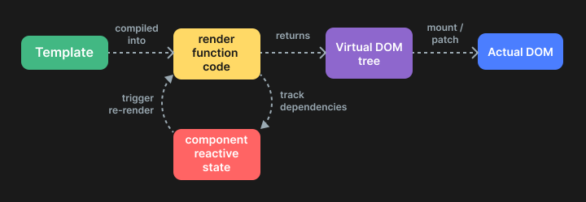

# 3. Vue.js 도입 (2019.01 ~ 2019.09)

2019년 초, 구성원 간의 합의에 이르게 되어 Vue.js를 채택하게 되었습니다.
공감대를 형성하여 결론에 도달하기 위한 요소는 다음과 같았습니다.
- 당장의 생산성에 문제가 없어야 한다. (개발 기간이 오래 걸리면 안된다)
- 어렵지 않아야 한다.
- 개발이 더 편해져야 한다.

## Vue 공부하기

Vue관련 오피셜한 Document가 잘 구성되어 있었습니다.

#### 1. 차이점 알아보기
기존에 사용하던 "JQuery + 바닐라 js"를 쓰는 것과 "Vuejs"를 사용하는 것에 대하여,  
두 방법으로 같은 결과물을 만든다고 가정했을 때, 차이점이 무엇인지  
알아가는 과정부터 시작했습니다.

이미 Vue를 사용해보았던 사람들의 후기도 구글링하여 곁들였더니, 지식을 습득하는데 도움이 되었습니다.

| 비교할 기능        | JQuery                                                                   | Vue.js                                                                   |
|---------------|--------------------------------------------------------------------------|--------------------------------------------------------------------------|
| 사용자 이벤트 핸들러 구현 | [스크린 샷 > JQuery Example](https://content.screencast.com/users/Byeongho_Kim/folders/Jing/media/9f80e5e4-3101-421c-b0e1-5c071b77fd8f/2019-09-26_0952.png)    | [JSFiddle > Vue.js Example](https://jsfiddle.net/byungho222/apx15eod/2/) |
| 트리 구현         | [JSFiddle > JQuery Example](https://jsfiddle.net/byungho222/37xtj1ug/2/) | [JSFiddle > Vue.js Example](https://jsfiddle.net/byungho222/37xtj1ug/2/) |

- 사용자 이벤트 핸들러 구현 예제를 통해서,   
  - JQuery에서는 UI 구성요소와 Data에 대한 변동 사항 최신화를 위한 모든 코드를 작성해야 했던 반면에,   
  - Vue.js에서는 사전에 정의한 State(Data)를 가지고 UI요소를 쉽게 제어할 뿐만 아니라 코드의 직관성도 높아질 수 있음을 확인하였습니다.
- 트리 구현 예제를 통해서 
  - JQuery에서는 재귀적 탐색을 통해 중복되는 요소를 선언적으로 처리할 수 없을 뿐만아니라, 추가되는 프로퍼티들에 대한 구현에 있어서 기존 코드의 50% 이상 재작성이 필요한 반면에
  - Vue.js에서는 선언적 요소를 지정해놓고 추가되는 프로퍼티에 대한 보완/삭제가 용이하다는 부분에서 주목할 수 있었습니다.

#### 2. 결정적인 컨셉
- 이러한 차이점 만큼이나 중요한 것은, 값의 변동만 명확히 처리하면 관련된 HTML Element는 Vue.js에 의해 다시 렌더링되므로,
- HTML Elment의 Visible 처리, InnerText처리 등에 크게 주목하지 않아도 된다는 점이 정말 매력적이었습니다.
- 진짜 "Reactive"를 경험한 느낌을 받았기 때문입니다. 이러한 원리는 Watcher에 대한 설명을 통해 짐작해볼 수 있었습니다.
- 
- 현재 오피셜 사이트에는 Vue3로 업데이트되어서, 해당 설명은 없으며 "Render Pipeline"으로 설명이 변경되어 있습니다 
- 

## Vue 실습하기

우선 프론트팀에서 인프라팀으로 직무를 변경했던 친한 동료와 함께 퀵 스타드를 진행했습니다.
[Vue CLI](https://cli.vuejs.org/)를 이용하면 손 쉽게 최첨단의 기술로 이루어진 프로젝트를 빌드업 할 수 있었는데요.
이런 방법은 package.json을 자동으로 완성해주는 과정이며,  
vue.js또는 react를 사용하는 우리에겐 이제 많이 익숙할 것 같습니다.

Vue.js를 기본으로 포함하되 Typescript, SASS, 유닛 테스트와 E2E 테스트를 위해 Jest와 Cypress를 최종적으로 선택하고 
Guide 프로젝트를 구성하여 하나하나 실습해보기 시작했습니다.

## Vue 관련 의사 결정하기

기존에 담당하던 Auto-campaign이라는 기능을 최적화하고 고도화하기 위한
바탕을 마련하고 좋은 방법을 조사하는 과정에 있었기 때문에,
사실 새로운 프레임워크를 도입하기에 적절한 시기였습니다.

따라서 어떤 부분이 최적화와 고도화에 도움이 될 수 있는지 의사 결정과정에서 설득하는 것이 가장 최우선의 목표였고,
그 다음 현재 인력이 Vue를 곧바로 사용할 수 있는 방법을 모색하는 것이 중요했습니다.

기존에 고려하지 않았던 Drag 관련 동작과 Touch 동작을 지원함으로써  
모바일 웹도 지원할 뿐만 아니라 사용자 인터랙션을 강화하고,   
더 나아가 특수 목적의 컴포넌트 또한 효율적인 구조로 정의할 수 있는 가능성을 열어주는 것이  
최적화 중에 하나라고 생각이 들었고, 말미암아 효율적인 UI 구현 수단이 필요하다는 부분을 강조하였습니다.  

Vue.js를 쓰는 일과 쓰지 않는 일에서의 명료한 차이점을 식별하고
새로운 프레임워크가 구현 작업에 어떤 영향을 줄 수 있는지를 점검하였습니다. 

현재의 안정성을 벗어나는 일은 쉽지 않았고,
어찌 될지 몰랐기에 도입하자는 확답을 얻지는 못했었으나, 지속적인 조사와 테스트를 할 수 있는 시간을 허락받았습니다.  
결과적으로 현재는 Vue.js 기반으로 웹 어플리케이션을 만들고 있습니다.
CTO님 나름의 소통 방법으로 구성원을 설득하고, 프로젝트가 최첨단이 될 수 있도록 이끌어주신 것 같습니다.
